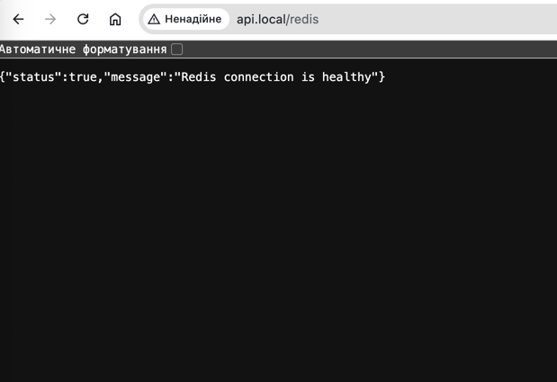
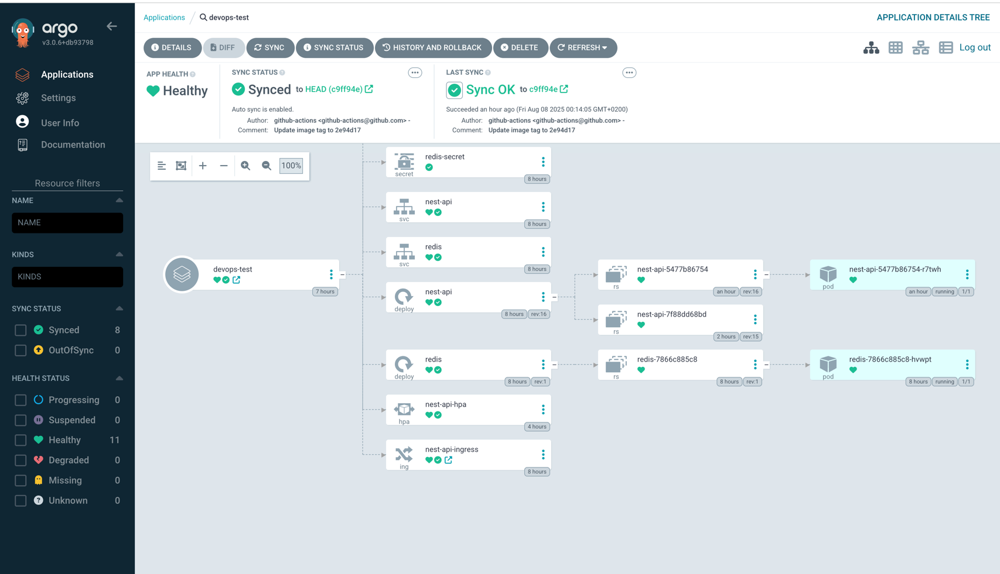

# DevOps Test Project — NestJS + Redis + Kubernetes + ArgoCD

Цей проєкт демонструє повний цикл розгортання Node.js (NestJS) застосунку з Redis у кластері Kubernetes з використанням Docker, CI/CD через GitHub Actions, та автоматичним деплоєм за допомогою ArgoCD (GitOps).

---

## 🧱 Архітектура

- NestJS API з ендпоінтом `/redis`, що підключається до Redis
- Redis як окремий Pod у кластері Kubernetes
- Контейнеризований додаток у Docker
- CI/CD: GitHub Actions → ArgoCD → Kubernetes
- Секрети, health checks, autoscaler, .dockerignore
- Оптимізований багатостадійний Dockerfile

---

## 🚀 Швидкий старт (Minikube)

             +-------------------------+
             |     GitHub Repository   |
             +------------+------------+
                          |
                          | git push
                          v
                  +------------------+
                  | GitHub Actions   |
                  | - Build & Push   |
                  | - ArgoCD Sync    |
                  +--------+---------+
                           |
                           v
                  +------------------+
                  |   ArgoCD Server  |
                  |  (auto sync app) |
                  +--------+---------+
                           |
          +-------------------------------+
          |         Kubernetes Cluster     |
          | +---------+     +-----------+  |
          | | NestJS  |<--->|   Redis   |  |
          | +---------+     +-----------+  |
          +-------------------------------+


Запуск Minikube
```bash
minikube start
minikube addons enable ingress

# Встановити Docker контекст Minikube
eval $(minikube docker-env)

Зібрати образ локально
docker build -t my-nest-app .

echo "127.0.0.1 api.local" | sudo tee -a /etc/hosts

# Застосувати маніфести
kubectl apply -f k8s/

# Перевірити поди
kubectl get pods

# Відкрити в браузері
minikube tunnel

curl http://api.local/redis
```

🐳 Docker
Багатостадійний Dockerfile (builder + runtime)

Базовий образ: node:20-alpine

npm ci для чистої установки залежностей

Застосунок запускається як непривілейований користувач node

Файли .dockerignore виключають зайві директорії (node_modules, dist, .git)

```bash
Копіювати
# Збірка
docker build -t my-nest-app .

# Запуск
docker run -p 3000:3000 my-nest-app


☸️ Kubernetes (k8s/)
Структура:
bash
Копіювати
k8s/
├── deployment.yaml         # NestJS Deployment
├── redis-deployment.yaml  # Redis Deployment
├── service.yaml           # Сервіси (NestJS + Redis)
├── ingress.yaml           # Ingress (Minikube)
├── configmap.yaml         # ENV змінні
├── secrets.yaml           # Redis пароль
├── hpa.yaml               # Автомасштабування
k8s-template/
├── deployment.template.yaml
Команди:
bash
Копіювати
kubectl apply -f k8s/
kubectl get all
kubectl port-forward svc/my-nest-app 3000:3000
curl http://localhost:3000/redis

 CI/CD: GitHub Actions + ArgoCD
CI/CD пайплайн автоматизує:

Збірку Docker-образу

Push до Docker Registry

Логін і sync у ArgoCD через CLI

Деплой у кластер Kubernetes
``` 

```bash

🔐 Безпека
Контейнери запускаються без root-доступу

Dockerfile → USER node

Pod → securityContext:

runAsNonRoot: true

allowPrivilegeEscalation: false

Redis захищений через Kubernetes Secret

(Бонус) NetworkPolicy блокує зовнішній трафік до Redis

🧠 Ендпоінт /redis
Ендпоінт /redis перевіряє роботу Redis через:

PING (має повернути PONG)

SET ключа

GET ключа

bash
Копіювати
curl http://localhost/redis
# {"ping":"PONG","set":"OK","get":"hello"}
📈 Autoscaling (HPA)
yaml
Копіювати
apiVersion: autoscaling/v2
kind: HorizontalPodAutoscaler
spec:
  scaleTargetRef:
    kind: Deployment
    name: my-nest-app
  minReplicas: 1
  maxReplicas: 5
  metrics:
    - type: Resource
      resource:
        name: cpu
        target:
          type: Utilization
          averageUtilization: 60
📊 Моніторинг (опційно)
Підтримка /metrics для Prometheus (NestJS middleware)

ServiceMonitor для інтеграції

Dashboards через Grafana

📄 Команди для перевірки
bash
Копіювати
kubectl get pods
kubectl logs deploy/my-nest-app
kubectl describe hpa
curl http://localhost/redis
kubectl get secrets
kubectl get ingress
📂 Структура репозиторію
arduino
Копіювати
.
├── Dockerfile
├── .dockerignore
├── .github/workflows/ci.yml
├── k8s/
│   ├── deployment.yaml
│   ├── redis-deployment.yaml
│   ├── service.yaml
│   ├── ingress.yaml
│   ├── configmap.yaml
│   ├── secrets.yaml
│   ├── hpa.yaml
│  k8s-template/
├   ├── deployment.template.yaml
├── src/
│   ├── app.module.ts
│   ├── redis.controller.ts
│   └── redis.service.ts
└── README.md
```
Посилання на репозиторій: [GitHub Repository](https://github.com/valentin1982/devops-test.git)